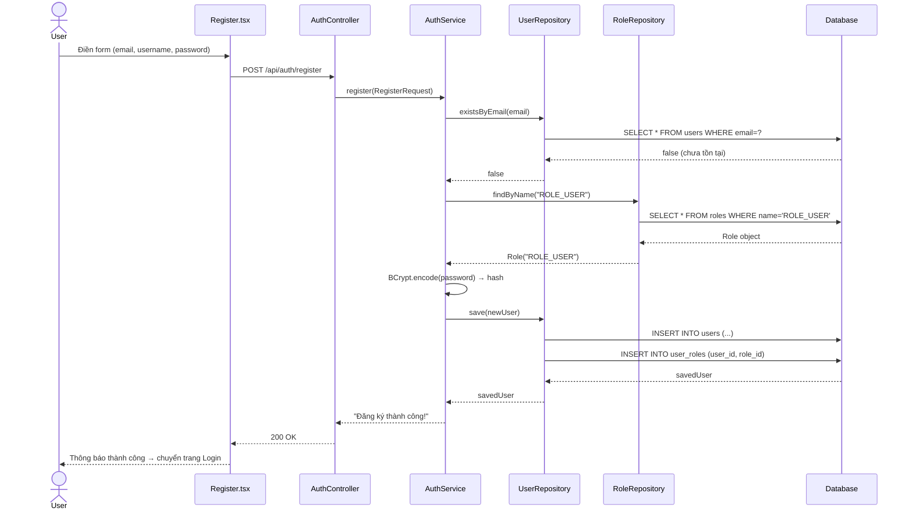
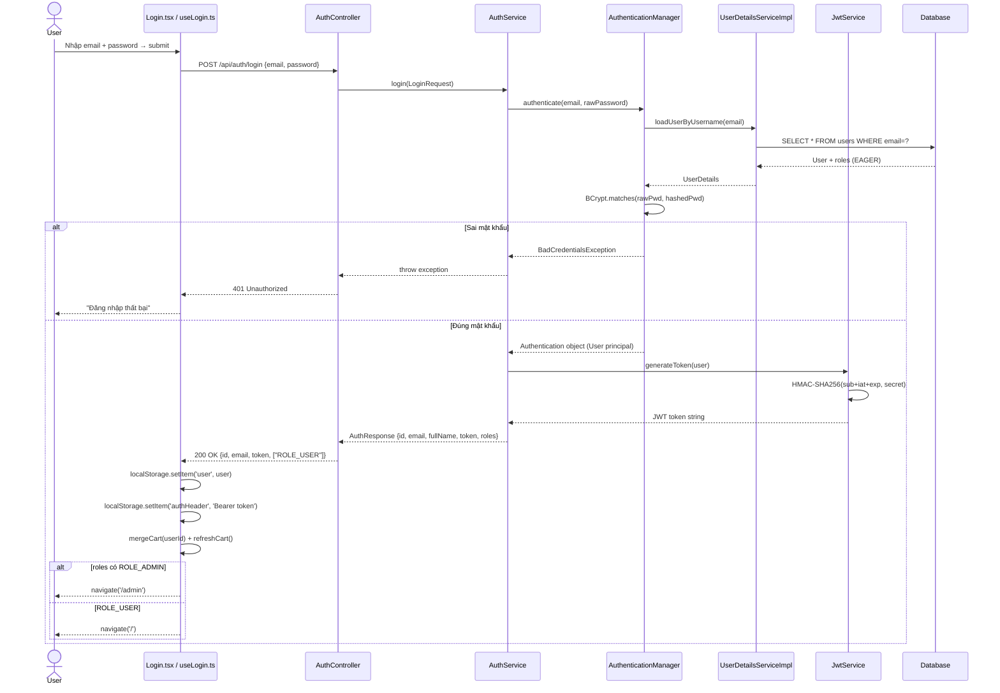
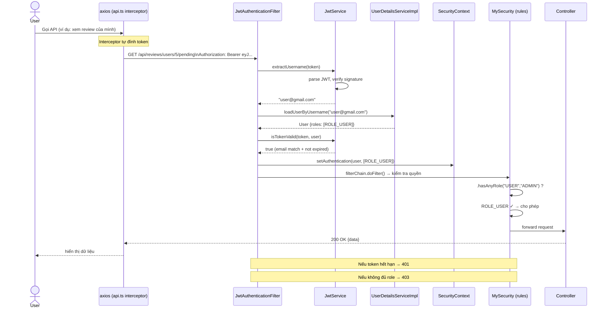

# Sequence Diagram — Đăng ký & Đăng nhập

---

## LUỒNG 1 — ĐĂNG KÝ (Register)

```
User        Register.tsx    AuthService.ts    AuthController    AuthService.java    UserRepository    RoleRepository    Database
 |               |                |                 |                  |                  |                 |               |
 |--[điền form]->|                |                 |                  |                  |                 |               |
 |               |                |                 |                  |                  |                 |               |
 |               |--POST /api/auth/register-------->|                  |                  |                 |               |
 |               |   {email,username,password,      |                  |                  |                 |               |
 |               |    fullName,phone}               |                  |                  |                 |               |
 |               |                |                 |                  |                  |                 |               |
 |               |                |                 |--register(req)-->|                  |                 |               |
 |               |                |                 |                  |                  |                 |               |
 |               |                |                 |                  |--existsByEmail-->|                 |               |
 |               |                |                 |                  |                  |--SELECT email-->|               |
 |               |                |                 |                  |                  |<--false---------| (chưa tồn tại)|
 |               |                |                 |                  |                  |                 |               |
 |               |                |                 |                  |--findByName("ROLE_USER")---------->|               |
 |               |                |                 |                  |                  |                 |--SELECT role->|
 |               |                |                 |                  |                  |                 |<--Role object-|
 |               |                |                 |                  |<--Role("ROLE_USER")----------------|               |
 |               |                |                 |                  |                  |                 |               |
 |               |                |                 |                  |--BCrypt.encode(password)           |               |
 |               |                |                 |                  |  → "$2a$10$..."                    |               |
 |               |                |                 |                  |                  |                 |               |
 |               |                |                 |                  |--save(newUser)-->|                 |               |
 |               |                |                 |                  |                  |--INSERT users-->|               |
 |               |                |                 |                  |                  |--INSERT user_roles              |
 |               |                |                 |                  |                  |<--savedUser-----|               |
 |               |                |                 |                  |                  |                 |               |
 |               |                |                 |<-"Đăng ký thành công!"--------------|                 |               |
 |               |<--200 OK "Đăng ký thành công!"--|                  |                  |                 |               |
 |<--thông báo---|                |                 |                  |                  |                 |               |
 |   thành công  |                |                 |                  |                  |                 |               |
```

### Trường hợp Email đã tồn tại:
```
 |               |                |                 |                  |                  |                 |               |
 |               |                |                 |                  |--existsByEmail-->|                 |               |
 |               |                |                 |                  |<--true-----------|  (đã tồn tại)   |               |
 |               |                |                 |<-"Lỗi: Email đã tồn tại!"          |                 |               |
 |               |<--400 Bad Request---------------|                  |                  |                 |               |
 |<--hiện lỗi----|                |                 |                  |                  |                 |               |
```

---

## LUỒNG 2 — ĐĂNG NHẬP (Login)

```
User      Login.tsx    useLogin.ts    AuthService.ts    AuthController    AuthService.java    AuthManager    UserDetailsSvc    JwtService    Database
 |            |              |               |                 |                  |               |                |              |            |
 |--[nhập]--->|              |               |                 |                  |               |                |              |            |
 |            |              |               |                 |                  |               |                |              |            |
 |            |--handleSubmit(email, pwd)--->|                 |                  |               |                |              |            |
 |            |              |               |                 |                  |               |                |              |            |
 |            |              |--POST /api/auth/login---------->|                  |               |                |              |            |
 |            |              |   {email, password}            |                  |               |                |              |            |
 |            |              |               |                 |--login(req)----->|               |                |              |            |
 |            |              |               |                 |                  |               |                |              |            |
 |            |              |               |                 |                  |--authenticate(email, rawPwd)   |              |            |
 |            |              |               |                 |                  |               |                |              |            |
 |            |              |               |                 |                  |               |--loadUserByUsername(email)    |            |
 |            |              |               |                 |                  |               |                |--findByEmail->|            |
 |            |              |               |                 |                  |               |                |  (DB query)  |            |
 |            |              |               |                 |                  |               |                |<--User obj---|            |
 |            |              |               |                 |                  |               |<--UserDetails--|              |            |
 |            |              |               |                 |                  |               |                |              |            |
 |            |              |               |                 |                  |               |--BCrypt.matches(rawPwd, hash) |            |
 |            |              |               |                 |                  |               |  → true / false|              |            |
 |            |              |               |                 |                  |               |                |              |            |
 |            |              |               |   [Nếu sai pwd] |                  |               |                |              |            |
 |            |              |               |                 |                  |<--BadCredentialsException------|              |            |
 |            |              |               |<--401 Unauthorized-----------------|               |                |              |            |
 |            |<--lỗi--------|               |                 |                  |               |                |              |            |
 |            |              |               |                 |                  |               |                |              |            |
 |            |              |               |   [Nếu đúng pwd]|                  |               |                |              |            |
 |            |              |               |                 |                  |<--Authentication object--------|              |            |
 |            |              |               |                 |                  |                                |              |            |
 |            |              |               |                 |                  |--generateToken(user)---------->|              |            |
 |            |              |               |                 |                  |                                |--HMAC-SHA256--|            |
 |            |              |               |                 |                  |<--"eyJhbGci...token"-----------|              |            |
 |            |              |               |                 |                  |                                |              |            |
 |            |              |               |                 |<--AuthResponse{ id, email, token, roles }---------|              |            |
 |            |              |               |<--200 OK { id, email, token, roles }                               |              |            |
 |            |              |               |                 |                  |                                |              |            |
 |            |              |--localStorage.setItem('user', user)                |                               |              |            |
 |            |              |--localStorage.setItem('authHeader', 'Bearer token')|                               |              |            |
 |            |              |               |                 |                  |                                |              |            |
 |            |              |--mergeCart(userId)---------->[CartService]         |                               |              |            |
 |            |              |--refreshCart()------------>[CartService]           |                               |              |            |
 |            |              |               |                 |                  |                                |              |            |
 |            |              |--navigate('/admin') nếu ROLE_ADMIN                 |                               |              |            |
 |            |              |--navigate('/')      nếu ROLE_USER                  |                               |              |            |
 |<--redirect--|              |               |                 |                  |                                |              |            |
```

---

## LUỒNG 3 — REQUEST CÓ TOKEN (Mọi request sau khi đăng nhập)

```
User    axios/api.ts    JwtAuthFilter    JwtService    UserDetailsSvc    SecurityContext    MySecurity    Controller
 |            |               |               |                |                |               |              |
 |--action--->|               |               |                |                |               |              |
 |            |               |               |                |                |               |              |
 |            |--interceptor tự đính token    |                |                |               |              |
 |            |  Authorization: Bearer eyJ..  |                |                |               |              |
 |            |               |               |                |                |               |              |
 |            |--HTTP Request---------------->|                |                |               |              |
 |            |               |               |                |                |               |              |
 |            |               |--extractUsername(token)------->|                |               |              |
 |            |               |               |--parse JWT     |                |               |              |
 |            |               |               |--verify sig    |                |               |              |
 |            |               |               |<--"user@gmail" |                |               |              |
 |            |               |               |                |                |               |              |
 |            |               |--loadUserByUsername(email)---->|                |               |              |
 |            |               |               |                |--findByEmail-->|               |              |
 |            |               |               |                |  (DB + roles)  |               |              |
 |            |               |               |                |<--User+roles---|               |              |
 |            |               |               |                |                |               |              |
 |            |               |--isTokenValid(token, user)     |                |               |              |
 |            |               |  (email match + not expired)   |                |               |              |
 |            |               |               |                |                |               |              |
 |            |               |--setAuthentication(user, roles)---------------->|               |              |
 |            |               |               |                |                |               |              |
 |            |               |--filterChain.doFilter()--------|----------------|-------------->|              |
 |            |               |               |                |                |               |              |
 |            |               |               |   [Kiểm tra quyền]             |               |              |
 |            |               |               |                |                |  .hasRole("ADMIN")?          |
 |            |               |               |                |                |  .permitAll()?               |
 |            |               |               |                |                |               |              |
 |            |               |               |   [Nếu không đủ quyền]         |               |              |
 |            |               |               |                |                |               |--403-------->|
 |            |<--403 Forbidden---------------|----------------|----------------|               |              |
 |            |               |               |                |                |               |              |
 |            |               |               |   [Nếu đủ quyền]               |               |              |
 |            |               |               |                |                |               |--OK--------->|
 |            |               |               |                |                |               |              |--xử lý-->
```

---

## Mermaid — Đăng ký



---

## Mermaid — Đăng nhập



---

## Mermaid — Request sau khi đăng nhập


