# Sequence Diagrams — Ecommerce Handmade

Tài liệu mô tả luồng xử lý chi tiết của từng chức năng chính, từ Frontend → Backend → Database.

---

## MỤC LỤC

### 👤 Người Dùng
1. [Đăng ký tài khoản](#1-đăng-ký-tài-khoản)
2. [Đăng nhập & Phân quyền](#2-đăng-nhập--phân-quyền)
3. [Quên mật khẩu](#3-quên-mật-khẩu)
4. [Đăng xuất](#4-đăng-xuất)
5. [Duyệt & Tìm kiếm sản phẩm](#5-duyệt--tìm-kiếm-sản-phẩm)
6. [Xem chi tiết sản phẩm & Đánh giá](#6-xem-chi-tiết-sản-phẩm--đánh-giá)
7. [Thêm vào giỏ hàng & Merge cart](#7-thêm-vào-giỏ-hàng--merge-cart)
8. [Đặt hàng COD](#8-đặt-hàng-cod)
9. [Đặt hàng & Thanh toán VNPay](#9-đặt-hàng--thanh-toán-vnpay)
10. [Xem lịch sử & Chi tiết đơn hàng](#10-xem-lịch-sử--chi-tiết-đơn-hàng)
11. [Wishlist](#11-wishlist)
12. [Vòng quay may mắn & Voucher](#12-vòng-quay-may-mắn--voucher)
13. [AI Chatbox](#13-ai-chatbox)
14. [Cập nhật hồ sơ cá nhân](#14-cập-nhật-hồ-sơ-cá-nhân)

### 🔧 Admin
15. [Đăng nhập Admin & Protected Route](#15-đăng-nhập-admin--protected-route)
16. [Admin Dashboard & Thống kê](#16-admin-dashboard--thống-kê)
17. [Quản lý sản phẩm (CRUD)](#17-quản-lý-sản-phẩm-crud)
18. [Quản lý đơn hàng & Cập nhật trạng thái](#18-quản-lý-đơn-hàng--cập-nhật-trạng-thái)
19. [Quản lý người dùng](#19-quản-lý-người-dùng)
20. [Quản lý Mini Game (Lucky Wheel)](#20-quản-lý-mini-game-lucky-wheel)
21. [Cấu hình AI Chatbox & FAQ](#21-cấu-hình-ai-chatbox--faq)
22. [Analytics & Báo cáo doanh thu](#22-analytics--báo-cáo-doanh-thu)

### 🔐 Xuyên suốt hệ thống
23. [Xác thực JWT (mọi request)](#23-xác-thực-jwt-mọi-request)
24. [State machine trạng thái đơn hàng](#24-state-machine-trạng-thái-đơn-hàng)

---

## 👤 NGƯỜI DÙNG

---

## 1. Đăng ký tài khoản

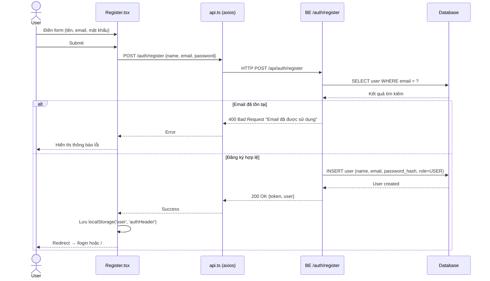
```mermaid
sequenceDiagram
    actor User
    participant Register as Register.tsx
    participant API as api.ts (axios)
    participant BE as BE /auth/register
    participant DB as Database

    User->>Register: Điền form (tên, email, mật khẩu)
    User->>Register: Submit
    Register->>API: POST /auth/register {name, email, password}
    API->>BE: HTTP POST /api/auth/register
    BE->>DB: SELECT user WHERE email = ?
    DB-->>BE: Kết quả tìm kiếm

    alt Email đã tồn tại
        BE-->>API: 400 Bad Request "Email đã được sử dụng"
        API-->>Register: Error
        Register-->>User: Hiển thị thông báo lỗi
    else Đăng ký hợp lệ
        BE->>DB: INSERT user (name, email, password_hash, role=USER)
        DB-->>BE: User created
        BE-->>API: 200 OK {token, user}
        API-->>Register: Success
        Register->>Register: Lưu localStorage('user', 'authHeader')
        Register-->>User: Redirect → /login hoặc /
    end
```

---

## 2. Đăng nhập & Phân quyền

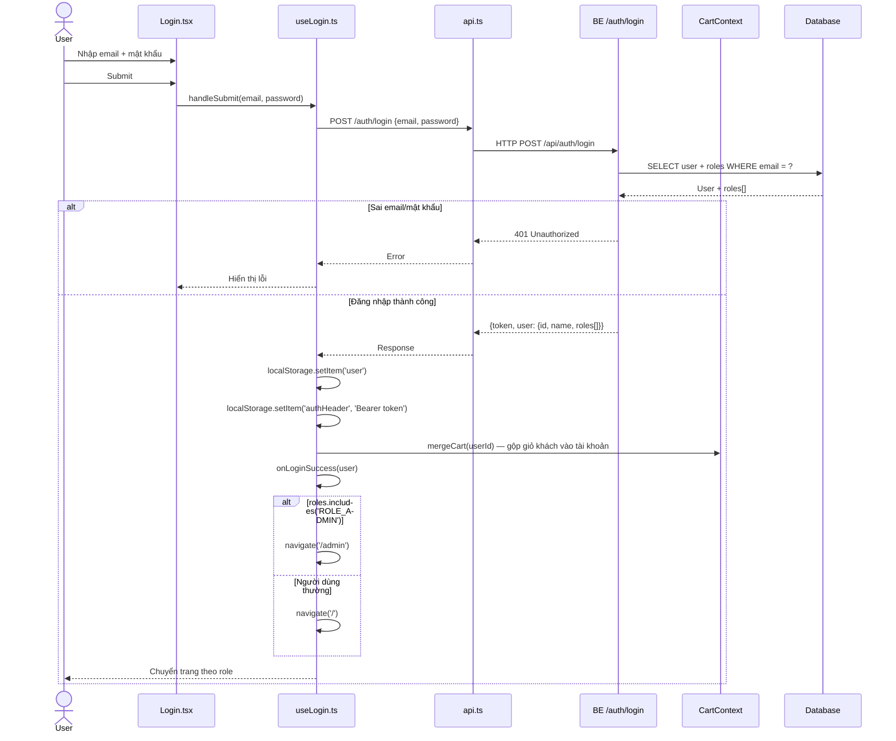
```mermaid
sequenceDiagram
    actor User
    participant Login as Login.tsx
    participant useLogin as useLogin.ts
    participant API as api.ts
    participant BE as BE /auth/login
    participant Cart as CartContext
    participant DB as Database

    User->>Login: Nhập email + mật khẩu
    User->>Login: Submit
    Login->>useLogin: handleSubmit(email, password)
    useLogin->>API: POST /auth/login {email, password}
    API->>BE: HTTP POST /api/auth/login
    BE->>DB: SELECT user + roles WHERE email = ?
    DB-->>BE: User + roles[]

    alt Sai email/mật khẩu
        BE-->>API: 401 Unauthorized
        API-->>useLogin: Error
        useLogin-->>Login: Hiển thị lỗi
    else Đăng nhập thành công
        BE-->>API: {token, user: {id, name, roles[]}}
        API-->>useLogin: Response
        useLogin->>useLogin: localStorage.setItem('user')
        useLogin->>useLogin: localStorage.setItem('authHeader', 'Bearer token')
        useLogin->>Cart: mergeCart(userId) — gộp giỏ khách vào tài khoản
        useLogin->>useLogin: onLoginSuccess(user)

        alt roles.includes('ROLE_ADMIN')
            useLogin->>useLogin: navigate('/admin')
        else Người dùng thường
            useLogin->>useLogin: navigate('/')
        end

        useLogin-->>User: Chuyển trang theo role
    end
```

---

## 3. Quên mật khẩu

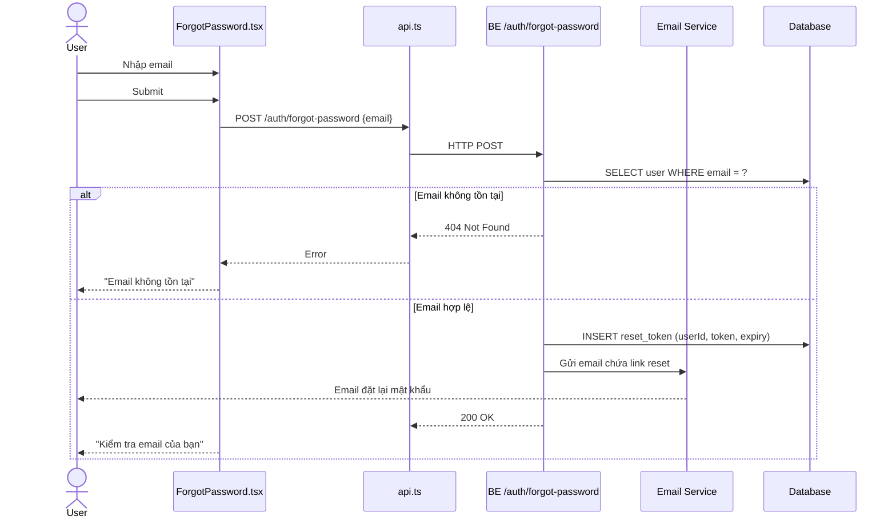
```mermaid
sequenceDiagram
    actor User
    participant FP as ForgotPassword.tsx
    participant API as api.ts
    participant BE as BE /auth/forgot-password
    participant Email as Email Service
    participant DB as Database

    User->>FP: Nhập email
    User->>FP: Submit
    FP->>API: POST /auth/forgot-password {email}
    API->>BE: HTTP POST
    BE->>DB: SELECT user WHERE email = ?

    alt Email không tồn tại
        BE-->>API: 404 Not Found
        API-->>FP: Error
        FP-->>User: "Email không tồn tại"
    else Email hợp lệ
        BE->>DB: INSERT reset_token (userId, token, expiry)
        BE->>Email: Gửi email chứa link reset
        Email-->>User: Email đặt lại mật khẩu
        BE-->>API: 200 OK
        FP-->>User: "Kiểm tra email của bạn"
    end
```

> ⚠️ **Lưu ý:** Reset password hiện là stub — cần BE endpoint thực sự.

---

## 4. Đăng xuất

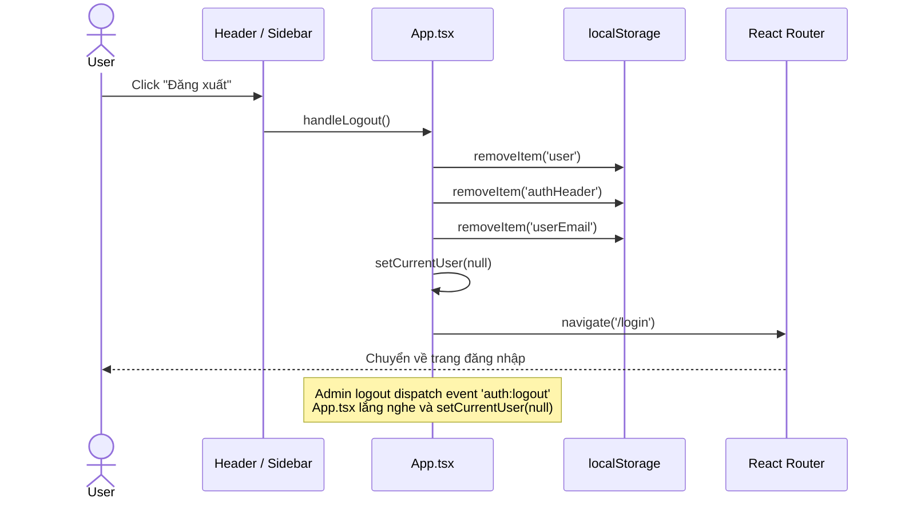
```mermaid
sequenceDiagram
    actor User
    participant Header as Header / Sidebar
    participant App as App.tsx
    participant LS as localStorage
    participant Router as React Router

    User->>Header: Click "Đăng xuất"
    Header->>App: handleLogout()
    App->>LS: removeItem('user')
    App->>LS: removeItem('authHeader')
    App->>LS: removeItem('userEmail')
    App->>App: setCurrentUser(null)
    App->>Router: navigate('/login')
    Router-->>User: Chuyển về trang đăng nhập

    Note over App: Admin logout dispatch event 'auth:logout'<br/>App.tsx lắng nghe và setCurrentUser(null)
```

---

## 5. Duyệt & Tìm kiếm sản phẩm

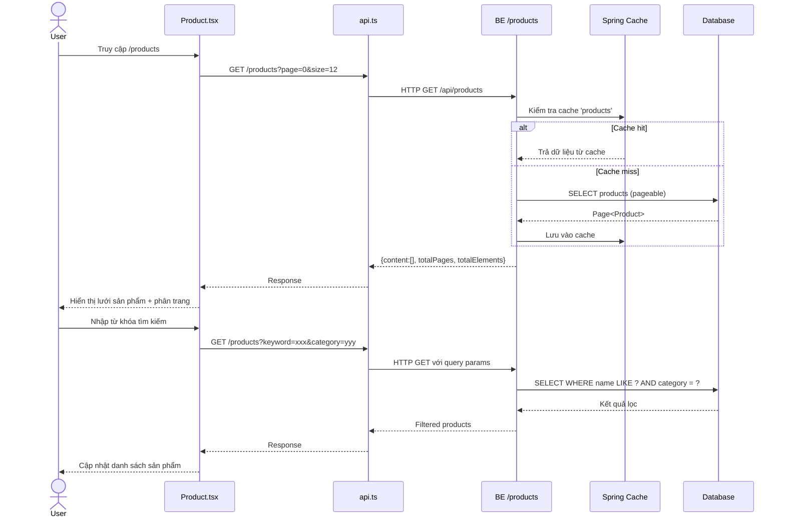
```mermaid
sequenceDiagram
    actor User
    participant Product as Product.tsx
    participant API as api.ts
    participant BE as BE /products
    participant Cache as Spring Cache
    participant DB as Database

    User->>Product: Truy cập /products
    Product->>API: GET /products?page=0&size=12
    API->>BE: HTTP GET /api/products
    BE->>Cache: Kiểm tra cache 'products'

    alt Cache hit
        Cache-->>BE: Trả dữ liệu từ cache
    else Cache miss
        BE->>DB: SELECT products (pageable)
        DB-->>BE: Page<Product>
        BE->>Cache: Lưu vào cache
    end

    BE-->>API: {content:[], totalPages, totalElements}
    API-->>Product: Response
    Product-->>User: Hiển thị lưới sản phẩm + phân trang

    User->>Product: Nhập từ khóa tìm kiếm
    Product->>API: GET /products?keyword=xxx&category=yyy
    API->>BE: HTTP GET với query params
    BE->>DB: SELECT WHERE name LIKE ? AND category = ?
    DB-->>BE: Kết quả lọc
    BE-->>API: Filtered products
    API-->>Product: Response
    Product-->>User: Cập nhật danh sách sản phẩm
```

---

## 6. Xem chi tiết sản phẩm & Đánh giá

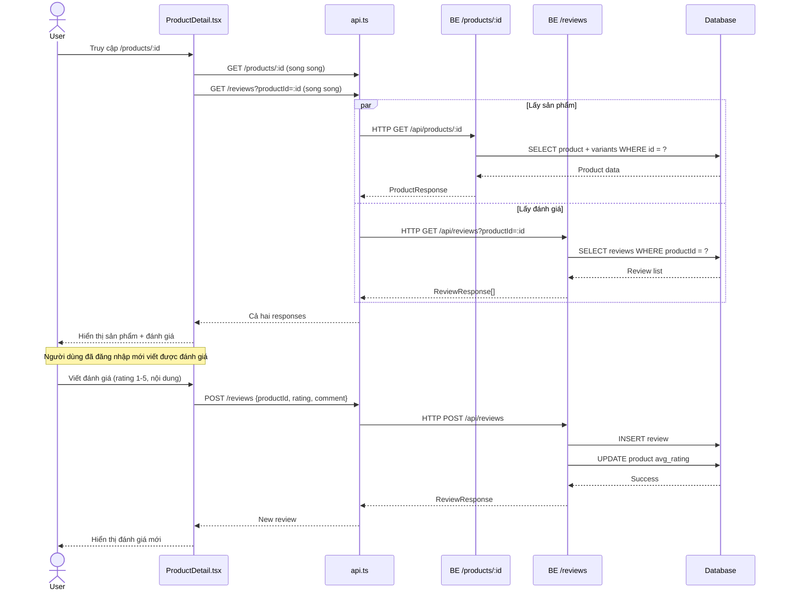
```mermaid
sequenceDiagram
    actor User
    participant PD as ProductDetail.tsx
    participant API as api.ts
    participant BE_P as BE /products/:id
    participant BE_R as BE /reviews
    participant DB as Database

    User->>PD: Truy cập /products/:id
    PD->>API: GET /products/:id (song song)
    PD->>API: GET /reviews?productId=:id (song song)

    par Lấy sản phẩm
        API->>BE_P: HTTP GET /api/products/:id
        BE_P->>DB: SELECT product + variants WHERE id = ?
        DB-->>BE_P: Product data
        BE_P-->>API: ProductResponse
    and Lấy đánh giá
        API->>BE_R: HTTP GET /api/reviews?productId=:id
        BE_R->>DB: SELECT reviews WHERE productId = ?
        DB-->>BE_R: Review list
        BE_R-->>API: ReviewResponse[]
    end

    API-->>PD: Cả hai responses
    PD-->>User: Hiển thị sản phẩm + đánh giá

    Note over User, PD: Người dùng đã đăng nhập mới viết được đánh giá
    User->>PD: Viết đánh giá (rating 1-5, nội dung)
    PD->>API: POST /reviews {productId, rating, comment}
    API->>BE_R: HTTP POST /api/reviews
    BE_R->>DB: INSERT review
    BE_R->>DB: UPDATE product avg_rating
    DB-->>BE_R: Success
    BE_R-->>API: ReviewResponse
    API-->>PD: New review
    PD-->>User: Hiển thị đánh giá mới
```

---

## 7. Thêm vào giỏ hàng & Merge cart

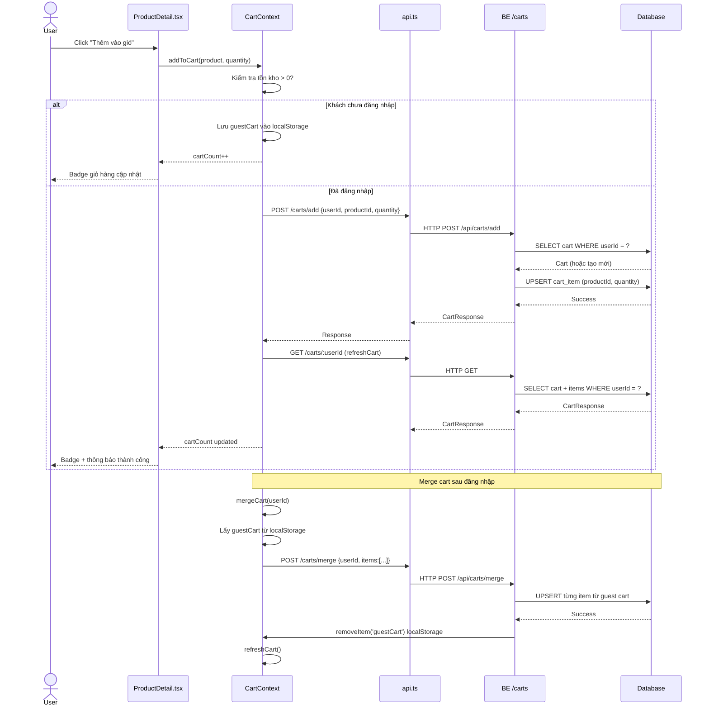
```mermaid
sequenceDiagram
    actor User
    participant PD as ProductDetail.tsx
    participant Cart as CartContext
    participant API as api.ts
    participant BE as BE /carts
    participant DB as Database

    User->>PD: Click "Thêm vào giỏ"
    PD->>Cart: addToCart(product, quantity)
    Cart->>Cart: Kiểm tra tồn kho > 0?

    alt Khách chưa đăng nhập
        Cart->>Cart: Lưu guestCart vào localStorage
        Cart-->>PD: cartCount++
        PD-->>User: Badge giỏ hàng cập nhật
    else Đã đăng nhập
        Cart->>API: POST /carts/add {userId, productId, quantity}
        API->>BE: HTTP POST /api/carts/add
        BE->>DB: SELECT cart WHERE userId = ?
        DB-->>BE: Cart (hoặc tạo mới)
        BE->>DB: UPSERT cart_item (productId, quantity)
        DB-->>BE: Success
        BE-->>API: CartResponse
        API-->>Cart: Response
        Cart->>API: GET /carts/:userId (refreshCart)
        API->>BE: HTTP GET
        BE->>DB: SELECT cart + items WHERE userId = ?
        DB-->>BE: CartResponse
        BE-->>API: CartResponse
        Cart-->>PD: cartCount updated
        PD-->>User: Badge + thông báo thành công
    end

    Note over Cart, DB: Merge cart sau đăng nhập
    Cart->>Cart: mergeCart(userId)
    Cart->>Cart: Lấy guestCart từ localStorage
    Cart->>API: POST /carts/merge {userId, items:[...]}
    API->>BE: HTTP POST /api/carts/merge
    BE->>DB: UPSERT từng item từ guest cart
    DB-->>BE: Success
    BE->>Cart: removeItem('guestCart') localStorage
    Cart->>Cart: refreshCart()
```

---

## 8. Đặt hàng COD

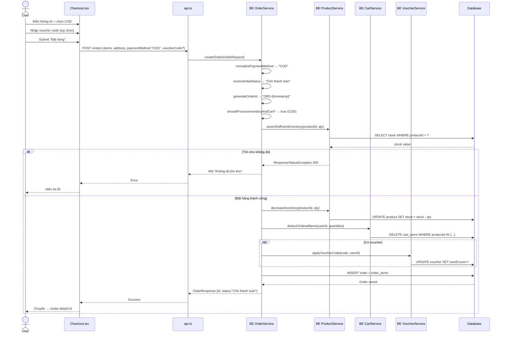
```mermaid
sequenceDiagram
    actor User
    participant Checkout as Checkout.tsx
    participant API as api.ts
    participant BE_O as BE OrderService
    participant BE_P as BE ProductService
    participant BE_C as BE CartService
    participant BE_V as BE VoucherService
    participant DB as Database

    User->>Checkout: Điền thông tin + chọn COD
    User->>Checkout: Nhập voucher code (tuỳ chọn)
    User->>Checkout: Submit "Đặt hàng"

    Checkout->>API: POST /orders {items, address, paymentMethod:"COD", voucherCode?}
    API->>BE_O: createOrder(OrderRequest)
    BE_O->>BE_O: normalizePaymentMethod → "COD"
    BE_O->>BE_O: resolveInitialStatus → "Chờ thanh toán"
    BE_O->>BE_O: generateOrderId → "ORD-{timestamp}"
    BE_O->>BE_O: shouldProcessInventoryAndCart? → true (COD)

    BE_O->>BE_P: assertSufficientInventory(productId, qty)
    BE_P->>DB: SELECT stock WHERE productId = ?
    DB-->>BE_P: stock value

    alt Tồn kho không đủ
        BE_P-->>BE_O: ResponseStatusException 400
        BE_O-->>API: 400 "Không đủ tồn kho"
        API-->>Checkout: Error
        Checkout-->>User: Hiển thị lỗi
    else Đặt hàng thành công
        BE_O->>BE_P: decreaseInventory(productId, qty)
        BE_P->>DB: UPDATE product SET stock = stock - qty
        BE_O->>BE_C: deductOrderedItems(userId, quantities)
        BE_C->>DB: DELETE cart_items WHERE productId IN (...)

        opt Có voucher
            BE_O->>BE_V: applyVoucherCode(code, userId)
            BE_V->>DB: UPDATE voucher SET usedCount++
        end

        BE_O->>DB: INSERT order + order_items
        DB-->>BE_O: Order saved
        BE_O-->>API: OrderResponse {id, status:"Chờ thanh toán"}
        API-->>Checkout: Success
        Checkout-->>User: Chuyển → /order-detail/:id
    end
```

---

## 9. Đặt hàng & Thanh toán VNPay

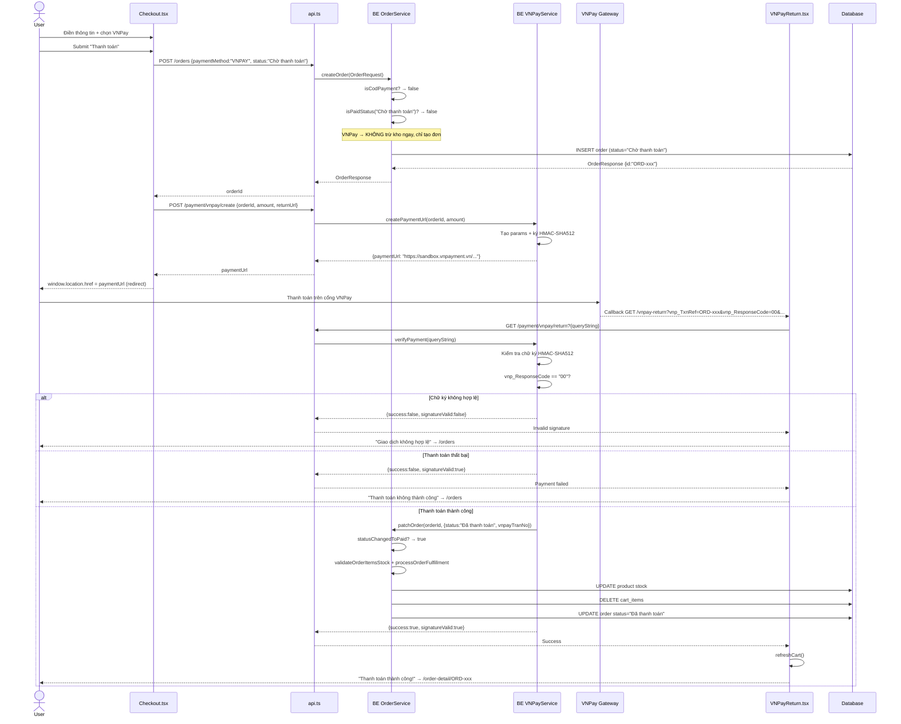
```mermaid
sequenceDiagram
    actor User
    participant Checkout as Checkout.tsx
    participant API as api.ts
    participant BE_O as BE OrderService
    participant BE_VNP as BE VNPayService
    participant VNPay as VNPay Gateway
    participant VNPayReturn as VNPayReturn.tsx
    participant DB as Database

    User->>Checkout: Điền thông tin + chọn VNPay
    User->>Checkout: Submit "Thanh toán"

    Checkout->>API: POST /orders {paymentMethod:"VNPAY", status:"Chờ thanh toán"}
    API->>BE_O: createOrder(OrderRequest)
    BE_O->>BE_O: isCodPayment? → false
    BE_O->>BE_O: isPaidStatus("Chờ thanh toán")? → false
    Note over BE_O: VNPay → KHÔNG trừ kho ngay, chỉ tạo đơn
    BE_O->>DB: INSERT order (status="Chờ thanh toán")
    DB-->>BE_O: OrderResponse {id:"ORD-xxx"}
    BE_O-->>API: OrderResponse
    API-->>Checkout: orderId

    Checkout->>API: POST /payment/vnpay/create {orderId, amount, returnUrl}
    API->>BE_VNP: createPaymentUrl(orderId, amount)
    BE_VNP->>BE_VNP: Tạo params + ký HMAC-SHA512
    BE_VNP-->>API: {paymentUrl: "https://sandbox.vnpayment.vn/..."}
    API-->>Checkout: paymentUrl
    Checkout-->>User: window.location.href = paymentUrl (redirect)

    User->>VNPay: Thanh toán trên cổng VNPay
    VNPay-->>VNPayReturn: Callback GET /vnpay-return?vnp_TxnRef=ORD-xxx&vnp_ResponseCode=00&...

    VNPayReturn->>API: GET /payment/vnpay/return?{queryString}
    API->>BE_VNP: verifyPayment(queryString)
    BE_VNP->>BE_VNP: Kiểm tra chữ ký HMAC-SHA512
    BE_VNP->>BE_VNP: vnp_ResponseCode == "00"?

    alt Chữ ký không hợp lệ
        BE_VNP-->>API: {success:false, signatureValid:false}
        API-->>VNPayReturn: Invalid signature
        VNPayReturn-->>User: "Giao dịch không hợp lệ" → /orders
    else Thanh toán thất bại
        BE_VNP-->>API: {success:false, signatureValid:true}
        API-->>VNPayReturn: Payment failed
        VNPayReturn-->>User: "Thanh toán không thành công" → /orders
    else Thanh toán thành công
        BE_VNP->>BE_O: patchOrder(orderId, {status:"Đã thanh toán", vnpayTranNo})
        BE_O->>BE_O: statusChangedToPaid? → true
        BE_O->>BE_O: validateOrderItemsStock + processOrderFulfillment
        BE_O->>DB: UPDATE product stock
        BE_O->>DB: DELETE cart_items
        BE_O->>DB: UPDATE order status="Đã thanh toán"
        BE_VNP-->>API: {success:true, signatureValid:true}
        API-->>VNPayReturn: Success
        VNPayReturn->>VNPayReturn: refreshCart()
        VNPayReturn-->>User: "Thanh toán thành công!" → /order-detail/ORD-xxx
    end
```

---

## 10. Xem lịch sử & Chi tiết đơn hàng

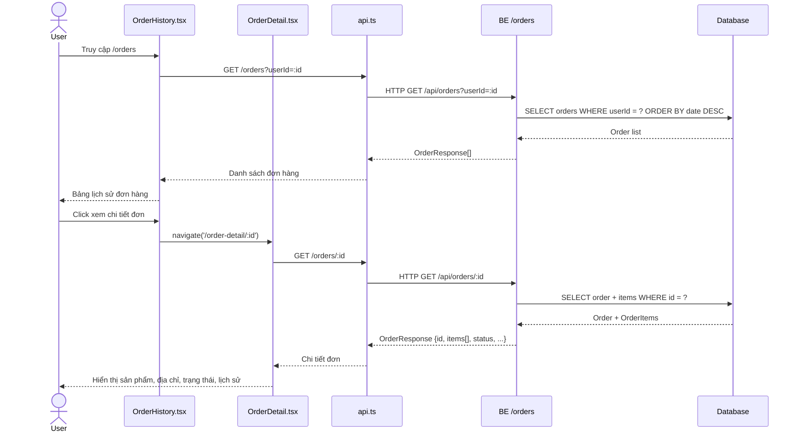
```mermaid
sequenceDiagram
    actor User
    participant OH as OrderHistory.tsx
    participant OD as OrderDetail.tsx
    participant API as api.ts
    participant BE as BE /orders
    participant DB as Database

    User->>OH: Truy cập /orders
    OH->>API: GET /orders?userId=:id
    API->>BE: HTTP GET /api/orders?userId=:id
    BE->>DB: SELECT orders WHERE userId = ? ORDER BY date DESC
    DB-->>BE: Order list
    BE-->>API: OrderResponse[]
    API-->>OH: Danh sách đơn hàng
    OH-->>User: Bảng lịch sử đơn hàng

    User->>OH: Click xem chi tiết đơn
    OH->>OD: navigate('/order-detail/:id')
    OD->>API: GET /orders/:id
    API->>BE: HTTP GET /api/orders/:id
    BE->>DB: SELECT order + items WHERE id = ?
    DB-->>BE: Order + OrderItems
    BE-->>API: OrderResponse {id, items[], status, ...}
    API-->>OD: Chi tiết đơn
    OD-->>User: Hiển thị sản phẩm, địa chỉ, trạng thái, lịch sử
```

---

## 11. Wishlist

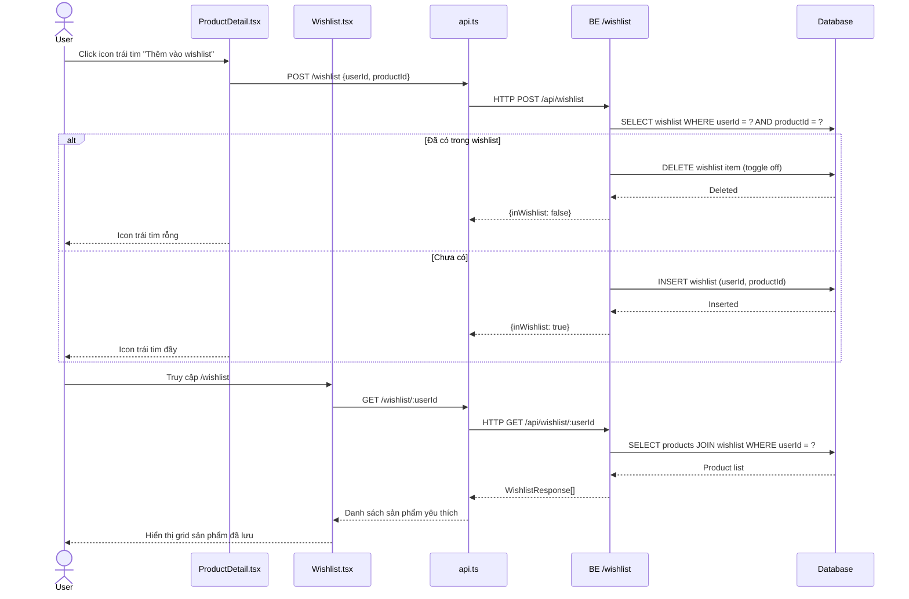
```mermaid
sequenceDiagram
    actor User
    participant PD as ProductDetail.tsx
    participant WL as Wishlist.tsx
    participant API as api.ts
    participant BE as BE /wishlist
    participant DB as Database

    User->>PD: Click icon trái tim "Thêm vào wishlist"
    PD->>API: POST /wishlist {userId, productId}
    API->>BE: HTTP POST /api/wishlist
    BE->>DB: SELECT wishlist WHERE userId = ? AND productId = ?

    alt Đã có trong wishlist
        BE->>DB: DELETE wishlist item (toggle off)
        DB-->>BE: Deleted
        BE-->>API: {inWishlist: false}
        PD-->>User: Icon trái tim rỗng
    else Chưa có
        BE->>DB: INSERT wishlist (userId, productId)
        DB-->>BE: Inserted
        BE-->>API: {inWishlist: true}
        PD-->>User: Icon trái tim đầy
    end

    User->>WL: Truy cập /wishlist
    WL->>API: GET /wishlist/:userId
    API->>BE: HTTP GET /api/wishlist/:userId
    BE->>DB: SELECT products JOIN wishlist WHERE userId = ?
    DB-->>BE: Product list
    BE-->>API: WishlistResponse[]
    API-->>WL: Danh sách sản phẩm yêu thích
    WL-->>User: Hiển thị grid sản phẩm đã lưu
```

---

## 12. Vòng quay may mắn & Voucher

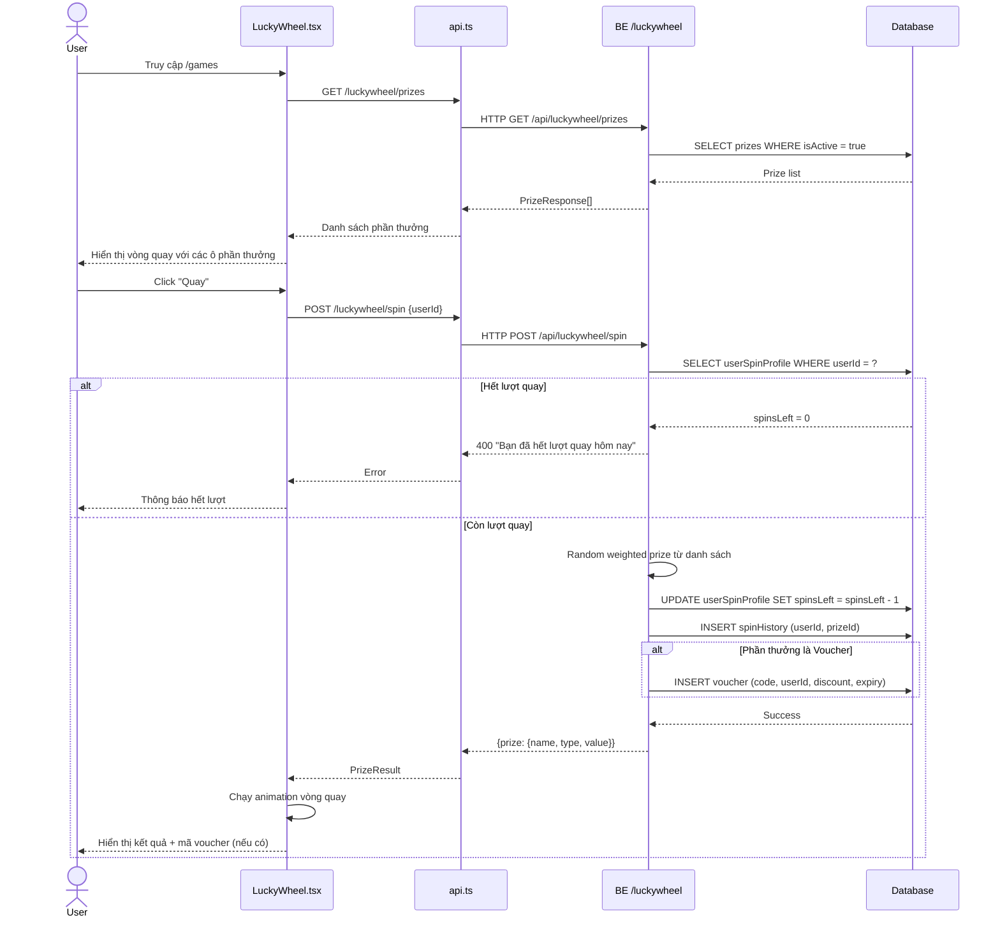
```mermaid
sequenceDiagram
    actor User
    participant LW as LuckyWheel.tsx
    participant API as api.ts
    participant BE as BE /luckywheel
    participant DB as Database

    User->>LW: Truy cập /games
    LW->>API: GET /luckywheel/prizes
    API->>BE: HTTP GET /api/luckywheel/prizes
    BE->>DB: SELECT prizes WHERE isActive = true
    DB-->>BE: Prize list
    BE-->>API: PrizeResponse[]
    API-->>LW: Danh sách phần thưởng
    LW-->>User: Hiển thị vòng quay với các ô phần thưởng

    User->>LW: Click "Quay"
    LW->>API: POST /luckywheel/spin {userId}
    API->>BE: HTTP POST /api/luckywheel/spin
    BE->>DB: SELECT userSpinProfile WHERE userId = ?

    alt Hết lượt quay
        DB-->>BE: spinsLeft = 0
        BE-->>API: 400 "Bạn đã hết lượt quay hôm nay"
        API-->>LW: Error
        LW-->>User: Thông báo hết lượt
    else Còn lượt quay
        BE->>BE: Random weighted prize từ danh sách
        BE->>DB: UPDATE userSpinProfile SET spinsLeft = spinsLeft - 1
        BE->>DB: INSERT spinHistory (userId, prizeId)

        alt Phần thưởng là Voucher
            BE->>DB: INSERT voucher (code, userId, discount, expiry)
        end

        DB-->>BE: Success
        BE-->>API: {prize: {name, type, value}}
        API-->>LW: PrizeResult
        LW->>LW: Chạy animation vòng quay
        LW-->>User: Hiển thị kết quả + mã voucher (nếu có)
    end
```

---

## 13. AI Chatbox

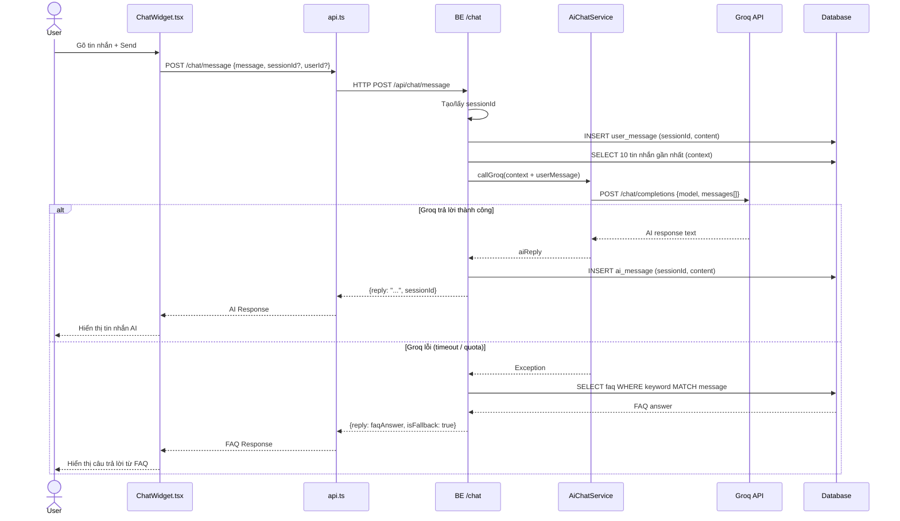
```mermaid
sequenceDiagram
    actor User
    participant CW as ChatWidget.tsx
    participant API as api.ts
    participant BE as BE /chat
    participant AiSvc as AiChatService
    participant Groq as Groq API
    participant DB as Database

    User->>CW: Gõ tin nhắn + Send
    CW->>API: POST /chat/message {message, sessionId?, userId?}
    API->>BE: HTTP POST /api/chat/message
    BE->>BE: Tạo/lấy sessionId
    BE->>DB: INSERT user_message (sessionId, content)
    BE->>DB: SELECT 10 tin nhắn gần nhất (context)

    BE->>AiSvc: callGroq(context + userMessage)
    AiSvc->>Groq: POST /chat/completions {model, messages[]}

    alt Groq trả lời thành công
        Groq-->>AiSvc: AI response text
        AiSvc-->>BE: aiReply
        BE->>DB: INSERT ai_message (sessionId, content)
        BE-->>API: {reply: "...", sessionId}
        API-->>CW: AI Response
        CW-->>User: Hiển thị tin nhắn AI
    else Groq lỗi (timeout / quota)
        AiSvc-->>BE: Exception
        BE->>DB: SELECT faq WHERE keyword MATCH message
        DB-->>BE: FAQ answer
        BE-->>API: {reply: faqAnswer, isFallback: true}
        API-->>CW: FAQ Response
        CW-->>User: Hiển thị câu trả lời từ FAQ
    end
```

---

## 14. Cập nhật hồ sơ cá nhân

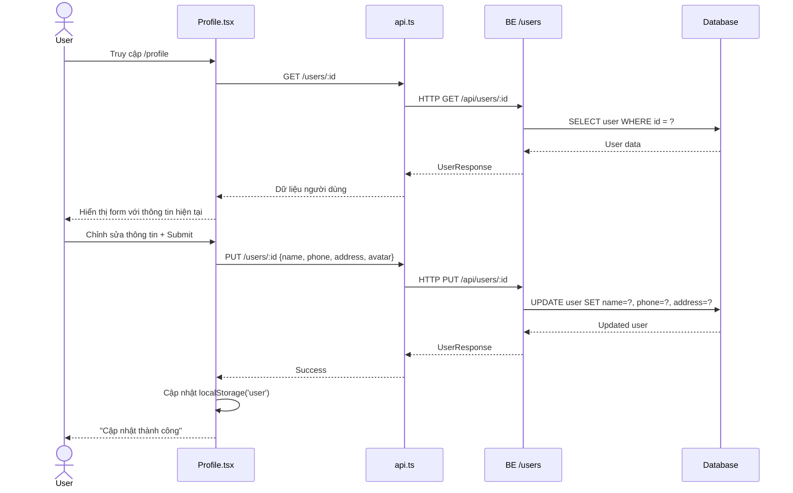
```mermaid
sequenceDiagram
    actor User
    participant Profile as Profile.tsx
    participant API as api.ts
    participant BE as BE /users
    participant DB as Database

    User->>Profile: Truy cập /profile
    Profile->>API: GET /users/:id
    API->>BE: HTTP GET /api/users/:id
    BE->>DB: SELECT user WHERE id = ?
    DB-->>BE: User data
    BE-->>API: UserResponse
    API-->>Profile: Dữ liệu người dùng
    Profile-->>User: Hiển thị form với thông tin hiện tại

    User->>Profile: Chỉnh sửa thông tin + Submit
    Profile->>API: PUT /users/:id {name, phone, address, avatar}
    API->>BE: HTTP PUT /api/users/:id
    BE->>DB: UPDATE user SET name=?, phone=?, address=?
    DB-->>BE: Updated user
    BE-->>API: UserResponse
    API-->>Profile: Success
    Profile->>Profile: Cập nhật localStorage('user')
    Profile-->>User: "Cập nhật thành công"
```

---

---

## 🔧 ADMIN

---

## 15. Đăng nhập Admin & Protected Route

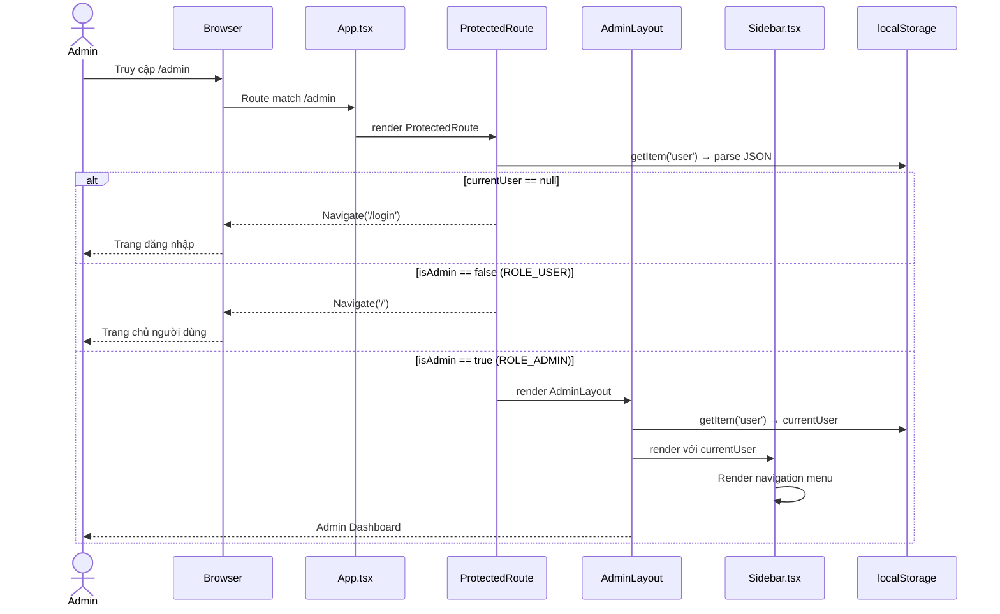
```mermaid
sequenceDiagram
    actor Admin
    participant Browser
    participant App as App.tsx
    participant PR as ProtectedRoute
    participant AL as AdminLayout
    participant Sidebar as Sidebar.tsx
    participant LS as localStorage

    Admin->>Browser: Truy cập /admin
    Browser->>App: Route match /admin
    App->>PR: render ProtectedRoute
    PR->>LS: getItem('user') → parse JSON

    alt currentUser == null
        PR-->>Browser: Navigate('/login')
        Browser-->>Admin: Trang đăng nhập
    else isAdmin == false (ROLE_USER)
        PR-->>Browser: Navigate('/')
        Browser-->>Admin: Trang chủ người dùng
    else isAdmin == true (ROLE_ADMIN)
        PR->>AL: render AdminLayout
        AL->>LS: getItem('user') → currentUser
        AL->>Sidebar: render với currentUser
        Sidebar->>Sidebar: Render navigation menu
        AL-->>Admin: Admin Dashboard
    end
```

---

## 16. Admin Dashboard & Thống kê

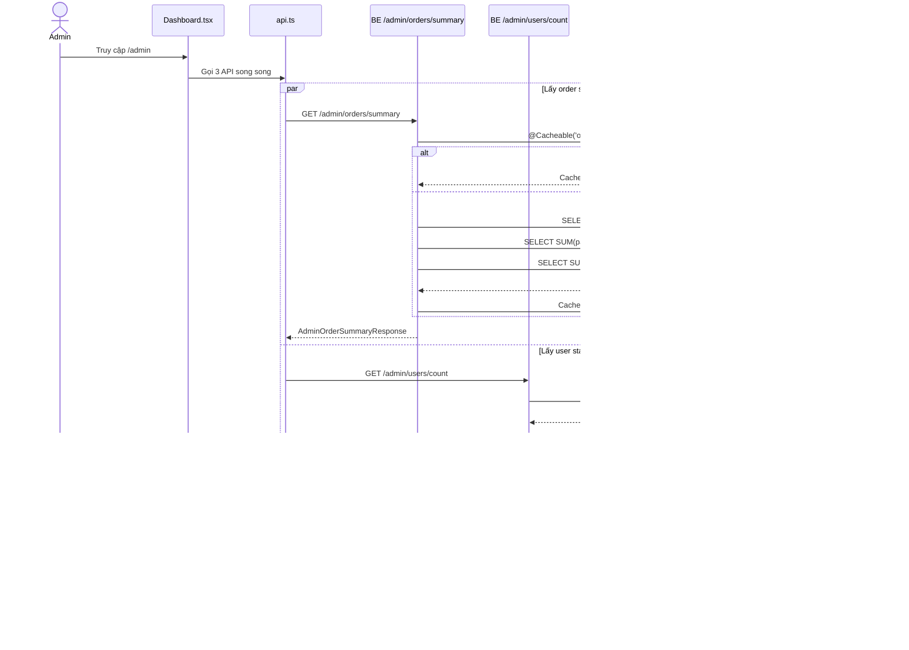
```mermaid
sequenceDiagram
    actor Admin
    participant DB_Page as Dashboard.tsx
    participant API as api.ts
    participant BE_O as BE /admin/orders/summary
    participant BE_U as BE /admin/users/count
    participant BE_P as BE /admin/products/count
    participant Cache as Spring Cache
    participant DB as Database

    Admin->>DB_Page: Truy cập /admin
    DB_Page->>API: Gọi 3 API song song

    par Lấy order summary
        API->>BE_O: GET /admin/orders/summary
        BE_O->>Cache: @Cacheable('orderSummary')
        alt Cache hit
            Cache-->>BE_O: Cached data
        else Cache miss
            BE_O->>DB: SELECT COUNT(*) GROUP BY status
            BE_O->>DB: SELECT SUM(payableAmount) WHERE status='Hoàn thành'
            BE_O->>DB: SELECT SUM revenue by range (today/week/month)
            DB-->>BE_O: Summary data
            BE_O->>Cache: Cache result
        end
        BE_O-->>API: AdminOrderSummaryResponse
    and Lấy user stats
        API->>BE_U: GET /admin/users/count
        BE_U->>DB: SELECT COUNT(*) FROM users
        DB-->>BE_U: count
        BE_U-->>API: {totalUsers, newUsersThisMonth}
    and Lấy product stats
        API->>BE_P: GET /admin/products/count
        BE_P->>DB: SELECT COUNT(*) FROM products
        DB-->>BE_P: count
        BE_P-->>API: {totalProducts}
    end

    API-->>DB_Page: Tất cả responses
    DB_Page-->>Admin: Dashboard với cards + biểu đồ
```

---

## 17. Quản lý sản phẩm (CRUD)

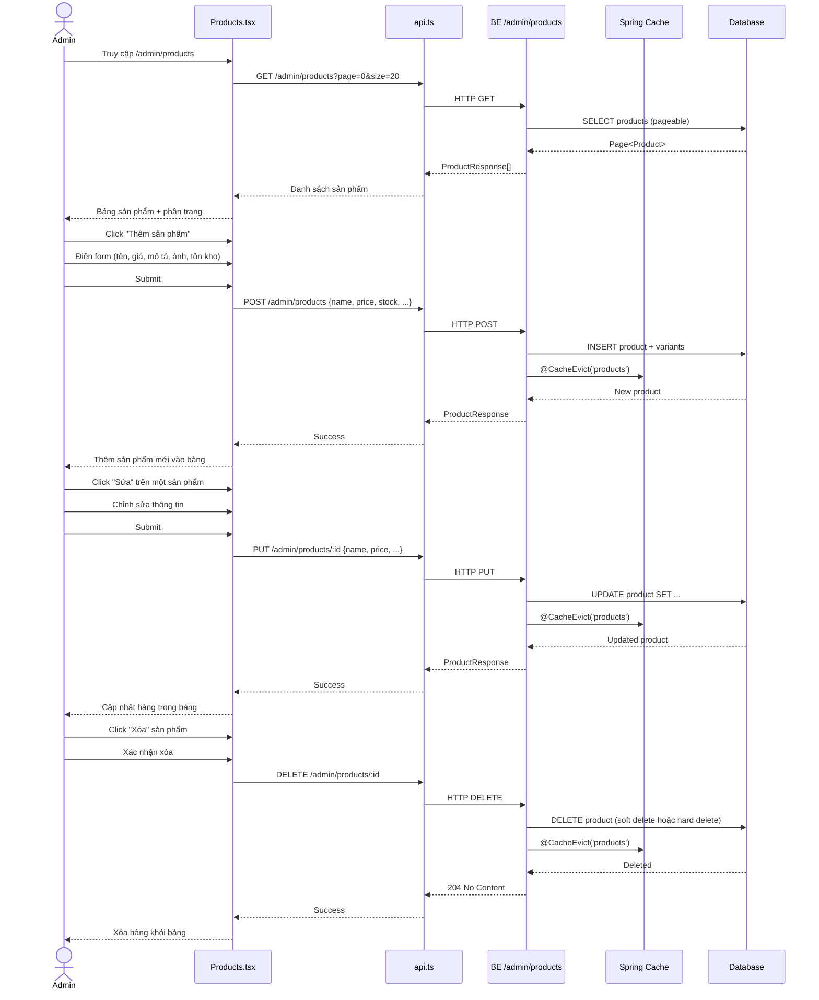
```mermaid
sequenceDiagram
    actor Admin
    participant Prod as Products.tsx
    participant API as api.ts
    participant BE as BE /admin/products
    participant Cache as Spring Cache
    participant DB as Database

    Admin->>Prod: Truy cập /admin/products
    Prod->>API: GET /admin/products?page=0&size=20
    API->>BE: HTTP GET
    BE->>DB: SELECT products (pageable)
    DB-->>BE: Page<Product>
    BE-->>API: ProductResponse[]
    API-->>Prod: Danh sách sản phẩm
    Prod-->>Admin: Bảng sản phẩm + phân trang

    Admin->>Prod: Click "Thêm sản phẩm"
    Admin->>Prod: Điền form (tên, giá, mô tả, ảnh, tồn kho)
    Admin->>Prod: Submit
    Prod->>API: POST /admin/products {name, price, stock, ...}
    API->>BE: HTTP POST
    BE->>DB: INSERT product + variants
    BE->>Cache: @CacheEvict('products')
    DB-->>BE: New product
    BE-->>API: ProductResponse
    API-->>Prod: Success
    Prod-->>Admin: Thêm sản phẩm mới vào bảng

    Admin->>Prod: Click "Sửa" trên một sản phẩm
    Admin->>Prod: Chỉnh sửa thông tin
    Admin->>Prod: Submit
    Prod->>API: PUT /admin/products/:id {name, price, ...}
    API->>BE: HTTP PUT
    BE->>DB: UPDATE product SET ...
    BE->>Cache: @CacheEvict('products')
    DB-->>BE: Updated product
    BE-->>API: ProductResponse
    API-->>Prod: Success
    Prod-->>Admin: Cập nhật hàng trong bảng

    Admin->>Prod: Click "Xóa" sản phẩm
    Admin->>Prod: Xác nhận xóa
    Prod->>API: DELETE /admin/products/:id
    API->>BE: HTTP DELETE
    BE->>DB: DELETE product (soft delete hoặc hard delete)
    BE->>Cache: @CacheEvict('products')
    DB-->>BE: Deleted
    BE-->>API: 204 No Content
    API-->>Prod: Success
    Prod-->>Admin: Xóa hàng khỏi bảng
```

---

## 18. Quản lý đơn hàng & Cập nhật trạng thái

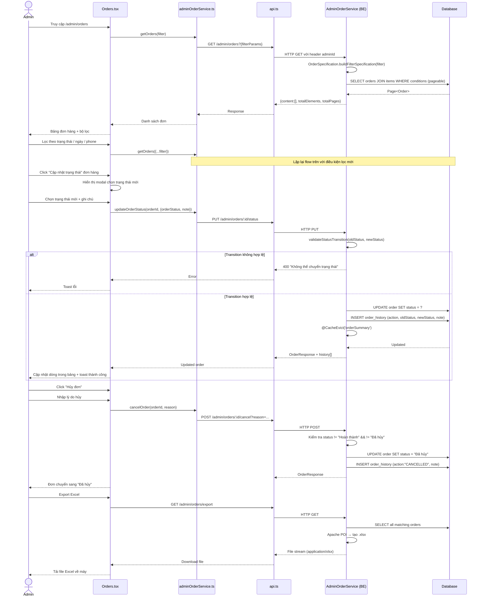
```mermaid
sequenceDiagram
    actor Admin
    participant Orders as Orders.tsx
    participant adminSvc as adminOrderService.ts
    participant API as api.ts
    participant BE as AdminOrderService (BE)
    participant DB as Database

    Admin->>Orders: Truy cập /admin/orders
    Orders->>adminSvc: getOrders(filter)
    adminSvc->>API: GET /admin/orders?{filterParams}
    API->>BE: HTTP GET với header adminId
    BE->>BE: OrderSpecification.buildFilterSpecification(filter)
    BE->>DB: SELECT orders JOIN items WHERE conditions (pageable)
    DB-->>BE: Page<Order>
    BE-->>API: {content:[], totalElements, totalPages}
    API-->>adminSvc: Response
    adminSvc-->>Orders: Danh sách đơn
    Orders-->>Admin: Bảng đơn hàng + bộ lọc

    Admin->>Orders: Lọc theo trạng thái / ngày / phone
    Orders->>adminSvc: getOrders({...filter})
    Note over adminSvc, DB: Lặp lại flow trên với điều kiện lọc mới

    Admin->>Orders: Click "Cập nhật trạng thái" đơn hàng
    Orders->>Orders: Hiển thị modal chọn trạng thái mới
    Admin->>Orders: Chọn trạng thái mới + ghi chú
    Orders->>adminSvc: updateOrderStatus(orderId, {orderStatus, note})
    adminSvc->>API: PUT /admin/orders/:id/status
    API->>BE: HTTP PUT
    BE->>BE: validateStatusTransition(oldStatus, newStatus)

    alt Transition không hợp lệ
        BE-->>API: 400 "Không thể chuyển trạng thái"
        API-->>Orders: Error
        Orders-->>Admin: Toast lỗi
    else Transition hợp lệ
        BE->>DB: UPDATE order SET status = ?
        BE->>DB: INSERT order_history (action, oldStatus, newStatus, note)
        BE->>BE: @CacheEvict('orderSummary')
        DB-->>BE: Updated
        BE-->>API: OrderResponse + history[]
        API-->>Orders: Updated order
        Orders-->>Admin: Cập nhật dòng trong bảng + toast thành công
    end

    Admin->>Orders: Click "Hủy đơn"
    Admin->>Orders: Nhập lý do hủy
    Orders->>adminSvc: cancelOrder(orderId, reason)
    adminSvc->>API: POST /admin/orders/:id/cancel?reason=...
    API->>BE: HTTP POST
    BE->>BE: Kiểm tra status != "Hoàn thành" && != "Đã hủy"
    BE->>DB: UPDATE order SET status = "Đã hủy"
    BE->>DB: INSERT order_history (action:"CANCELLED", note)
    BE-->>API: OrderResponse
    Orders-->>Admin: Đơn chuyển sang "Đã hủy"

    Admin->>Orders: Export Excel
    Orders->>API: GET /admin/orders/export
    API->>BE: HTTP GET
    BE->>DB: SELECT all matching orders
    BE->>BE: Apache POI → tạo .xlsx
    BE-->>API: File stream (application/xlsx)
    API-->>Orders: Download file
    Orders-->>Admin: Tải file Excel về máy
```

---

## 19. Quản lý người dùng

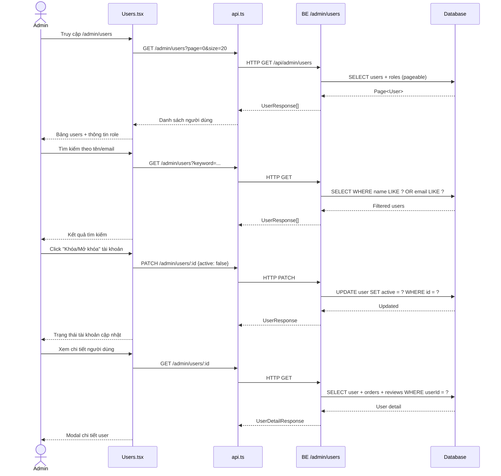
```mermaid
sequenceDiagram
    actor Admin
    participant Users as Users.tsx
    participant API as api.ts
    participant BE as BE /admin/users
    participant DB as Database

    Admin->>Users: Truy cập /admin/users
    Users->>API: GET /admin/users?page=0&size=20
    API->>BE: HTTP GET /api/admin/users
    BE->>DB: SELECT users + roles (pageable)
    DB-->>BE: Page<User>
    BE-->>API: UserResponse[]
    API-->>Users: Danh sách người dùng
    Users-->>Admin: Bảng users + thông tin role

    Admin->>Users: Tìm kiếm theo tên/email
    Users->>API: GET /admin/users?keyword=...
    API->>BE: HTTP GET
    BE->>DB: SELECT WHERE name LIKE ? OR email LIKE ?
    DB-->>BE: Filtered users
    BE-->>API: UserResponse[]
    Users-->>Admin: Kết quả tìm kiếm

    Admin->>Users: Click "Khóa/Mở khóa" tài khoản
    Users->>API: PATCH /admin/users/:id {active: false}
    API->>BE: HTTP PATCH
    BE->>DB: UPDATE user SET active = ? WHERE id = ?
    DB-->>BE: Updated
    BE-->>API: UserResponse
    Users-->>Admin: Trạng thái tài khoản cập nhật

    Admin->>Users: Xem chi tiết người dùng
    Users->>API: GET /admin/users/:id
    API->>BE: HTTP GET
    BE->>DB: SELECT user + orders + reviews WHERE userId = ?
    DB-->>BE: User detail
    BE-->>API: UserDetailResponse
    Users-->>Admin: Modal chi tiết user
```

---

## 20. Quản lý Mini Game (Lucky Wheel)

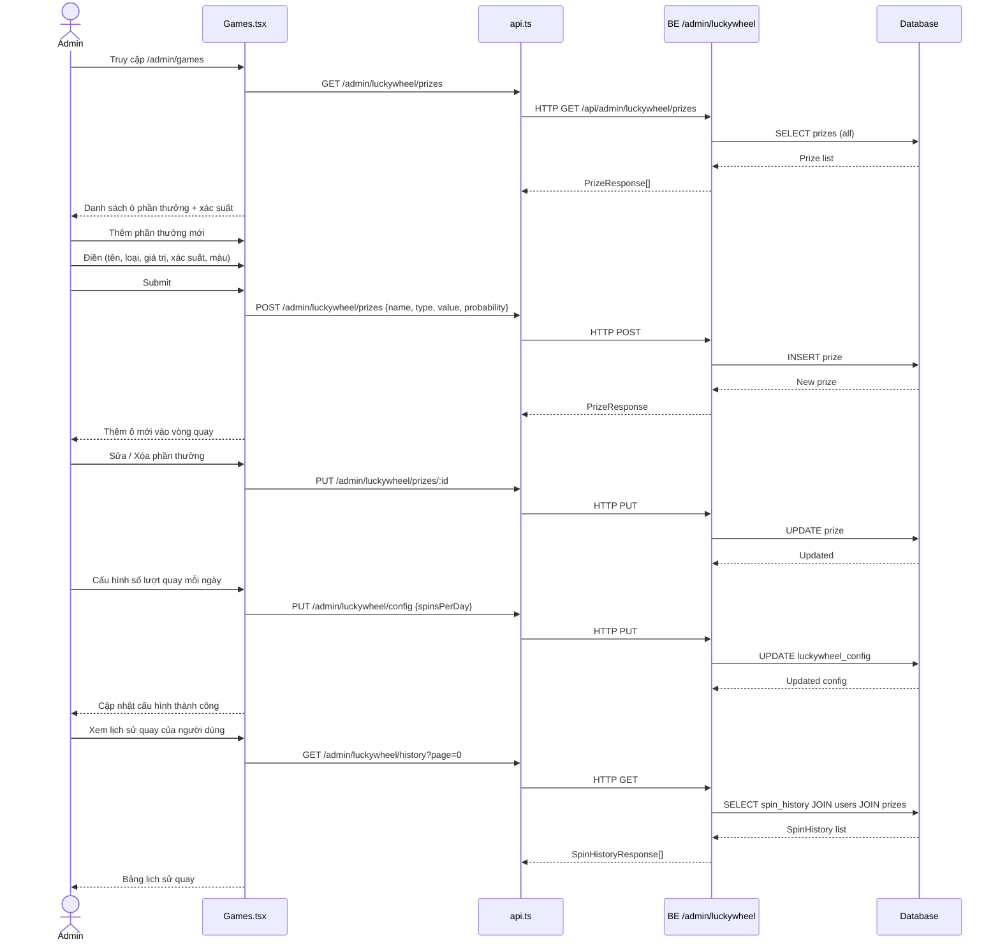
```mermaid
sequenceDiagram
    actor Admin
    participant Games as Games.tsx
    participant API as api.ts
    participant BE as BE /admin/luckywheel
    participant DB as Database

    Admin->>Games: Truy cập /admin/games
    Games->>API: GET /admin/luckywheel/prizes
    API->>BE: HTTP GET /api/admin/luckywheel/prizes
    BE->>DB: SELECT prizes (all)
    DB-->>BE: Prize list
    BE-->>API: PrizeResponse[]
    Games-->>Admin: Danh sách ô phần thưởng + xác suất

    Admin->>Games: Thêm phần thưởng mới
    Admin->>Games: Điền (tên, loại, giá trị, xác suất, màu)
    Admin->>Games: Submit
    Games->>API: POST /admin/luckywheel/prizes {name, type, value, probability}
    API->>BE: HTTP POST
    BE->>DB: INSERT prize
    DB-->>BE: New prize
    BE-->>API: PrizeResponse
    Games-->>Admin: Thêm ô mới vào vòng quay

    Admin->>Games: Sửa / Xóa phần thưởng
    Games->>API: PUT /admin/luckywheel/prizes/:id
    API->>BE: HTTP PUT
    BE->>DB: UPDATE prize
    DB-->>BE: Updated

    Admin->>Games: Cấu hình số lượt quay mỗi ngày
    Games->>API: PUT /admin/luckywheel/config {spinsPerDay}
    API->>BE: HTTP PUT
    BE->>DB: UPDATE luckywheel_config
    DB-->>BE: Updated config
    Games-->>Admin: Cập nhật cấu hình thành công

    Admin->>Games: Xem lịch sử quay của người dùng
    Games->>API: GET /admin/luckywheel/history?page=0
    API->>BE: HTTP GET
    BE->>DB: SELECT spin_history JOIN users JOIN prizes
    DB-->>BE: SpinHistory list
    BE-->>API: SpinHistoryResponse[]
    Games-->>Admin: Bảng lịch sử quay
```

---

## 21. Cấu hình AI Chatbox & FAQ

```mermaid
sequenceDiagram
    actor Admin
    participant Promo as Promotions.tsx (Chatbox Admin)
    participant API as api.ts
    participant BE_Cfg as BE /admin/chat/config
    participant BE_FAQ as BE /admin/chat/faq
    participant DB as Database

    Admin->>Promo: Truy cập /admin/promotions
    Promo->>API: GET /admin/chat/config (song song)
    Promo->>API: GET /admin/chat/faq (song song)

    par Load config
        API->>BE_Cfg: HTTP GET /api/admin/chat/config
        BE_Cfg->>DB: SELECT ai_configuration (latest)
        DB-->>BE_Cfg: AiConfiguration
        BE_Cfg-->>API: ChatConfigDTO
    and Load FAQ
        API->>BE_FAQ: HTTP GET /api/admin/chat/faq
        BE_FAQ->>DB: SELECT faq_items WHERE isActive = true
        DB-->>BE_FAQ: FAQ list
        BE_FAQ-->>API: FaqResponse[]
    end

    API-->>Promo: Config + FAQ data
    Promo-->>Admin: Form cấu hình AI + bảng FAQ

    Admin->>Promo: Chỉnh sửa API Key / Model / Prompt
    Admin->>Promo: Submit config
    Promo->>API: PUT /admin/chat/config {apiKey, model, systemPrompt}
    API->>BE_Cfg: HTTP PUT
    BE_Cfg->>DB: UPDATE ai_configuration
    DB-->>BE_Cfg: Updated
    BE_Cfg-->>API: ChatConfigDTO
    Promo-->>Admin: "Cập nhật cấu hình thành công"

    Admin->>Promo: Thêm câu hỏi FAQ mới
    Admin->>Promo: Điền (keyword, question, answer)
    Admin->>Promo: Submit
    Promo->>API: POST /admin/chat/faq {keyword, question, answer}
    API->>BE_FAQ: HTTP POST
    BE_FAQ->>DB: INSERT faq_item
    DB-->>BE_FAQ: New FAQ
    BE_FAQ-->>API: FaqResponse
    Promo-->>Admin: Thêm vào bảng FAQ

    Admin->>Promo: Xóa / Tắt FAQ item
    Promo->>API: DELETE /admin/chat/faq/:id
    API->>BE_FAQ: HTTP DELETE
    BE_FAQ->>DB: DELETE hoặc UPDATE isActive=false
    DB-->>BE_FAQ: Done
    Promo-->>Admin: Cập nhật bảng
```

---

## 22. Analytics & Báo cáo doanh thu

```mermaid
sequenceDiagram
    actor Admin
    participant Analytics as Analytics.tsx
    participant API as api.ts
    participant BE_Sum as BE /admin/orders/summary
    participant BE_Rev as BE /admin/analytics/revenue
    participant Cache as Spring Cache
    participant DB as Database

    Admin->>Analytics: Truy cập /admin/analytics
    Analytics->>API: Gọi song song nhiều API

    par Lấy order summary (cached)
        API->>BE_Sum: GET /admin/orders/summary
        BE_Sum->>Cache: @Cacheable('orderSummary')
        alt Cache hit
            Cache-->>BE_Sum: Cached result
        else Cache miss
            BE_Sum->>DB: SELECT COUNT GROUP BY status
            BE_Sum->>DB: SELECT SUM revenue (today/week/month/total)
            BE_Sum->>DB: SELECT payment method stats
            DB-->>BE_Sum: Aggregated data
            BE_Sum->>Cache: Lưu cache
        end
        BE_Sum-->>API: AdminOrderSummaryResponse
    and Lấy daily revenue chart
        API->>BE_Rev: GET /admin/analytics/revenue?range=30d
        BE_Rev->>DB: SELECT DATE(createdAt), SUM(payableAmount) GROUP BY DATE
        DB-->>BE_Rev: [{date, revenue}]
        BE_Rev-->>API: DailyRevenueResponse[]
    and Lấy top products
        API->>BE_Rev: GET /admin/analytics/top-products?limit=10
        BE_Rev->>DB: SELECT productName, SUM(quantity) GROUP BY productName ORDER BY sum DESC
        DB-->>BE_Rev: TopProductResponse[]
        BE_Rev-->>API: TopProductResponse[]
    end

    API-->>Analytics: Tất cả data
    Analytics-->>Admin: Biểu đồ doanh thu + top sản phẩm + KPI cards

    Admin->>Analytics: Chọn khoảng thời gian khác
    Analytics->>API: GET /admin/analytics/revenue?from=...&to=...
    API->>BE_Rev: HTTP GET với date range
    BE_Rev->>DB: SELECT với WHERE createdAt BETWEEN ? AND ?
    DB-->>BE_Rev: Filtered revenue data
    BE_Rev-->>API: Response
    API-->>Analytics: Updated data
    Analytics-->>Admin: Biểu đồ cập nhật theo khoảng thời gian mới
```

---

---

## 🔐 XUYÊN SUỐT HỆ THỐNG

---

## 23. Xác thực JWT (mọi request)

```mermaid
sequenceDiagram
    participant FE as api.ts (axios interceptor)
    participant LS as localStorage
    participant JwtFilter as JwtAuthFilter (BE)
    participant JwtSvc as JwtService
    participant UserSvc as UserDetailsService
    participant Controller as BE Controller
    participant DB as Database

    FE->>LS: getTokenFromStorage()
    LS-->>FE: "Bearer eyJhbGci..."

    FE->>FE: config.headers.Authorization = token
    FE->>JwtFilter: HTTP Request + Authorization header

    JwtFilter->>JwtFilter: Tách token từ header
    JwtFilter->>JwtSvc: validateToken(token)
    JwtSvc->>JwtSvc: Kiểm tra signature + expiry

    alt Token không hợp lệ / hết hạn
        JwtSvc-->>JwtFilter: false
        JwtFilter-->>FE: 401 Unauthorized
        FE->>FE: Response interceptor: 401 detected
        FE->>LS: removeItem('user', 'authHeader', 'userEmail')
        FE-->>FE: Reject error
    else Token hợp lệ
        JwtSvc->>JwtSvc: extractUsername(token) → email
        JwtFilter->>UserSvc: loadUserByUsername(email)
        UserSvc->>DB: SELECT user + roles WHERE email = ?
        DB-->>UserSvc: User + authorities
        UserSvc-->>JwtFilter: UserDetails
        JwtFilter->>JwtFilter: setAuthentication(SecurityContext)
        JwtFilter->>Controller: Pass request
        Controller->>Controller: Xử lý business logic
        Controller-->>FE: 200 OK + Response
    end

    Note over FE: Request bị cancel (navigate) →<br/>ERR_CANCELED → return null (không crash UI)
```

---

## 24. State machine trạng thái đơn hàng

```mermaid
stateDiagram-v2
    [*] --> ChờThanhToán : Tạo đơn (COD hoặc VNPay)

    ChờThanhToán --> ĐangXửLý : Admin xác nhận
    ChờThanhToán --> ĐãHủy : Admin/User hủy
    ChờThanhToán --> ĐãThanhToán : VNPay callback thành công

    ĐãThanhToán --> ĐangXửLý : Admin xác nhận
    ĐãThanhToán --> ĐãHủy : Admin hủy (có lý do)

    ĐangXửLý --> ĐangGiaoHàng : Admin giao hàng
    ĐangXửLý --> ĐãHủy : Admin hủy

    ĐangGiaoHàng --> HoànThành : Giao thành công
    ĐangGiaoHàng --> ĐãHủy : Giao thất bại

    HoànThành --> [*]
    ĐãHủy --> [*]

    note right of ChờThanhToán
        COD: trừ kho + giỏ ngay
        VNPay: chưa trừ kho
    end note

    note right of ĐãThanhToán
        VNPay: trừ kho + giỏ
        ngay khi callback về
    end note
```

---

## Tóm tắt các API endpoints chính

| Nhóm | Method | Endpoint | Chức năng |
|------|--------|----------|-----------|
| **Auth** | POST | `/auth/login` | Đăng nhập |
| | POST | `/auth/register` | Đăng ký |
| | POST | `/auth/forgot-password` | Quên mật khẩu |
| **Products** | GET | `/products` | Danh sách sản phẩm |
| | GET | `/products/:id` | Chi tiết sản phẩm |
| **Cart** | GET | `/carts/:userId` | Lấy giỏ hàng |
| | POST | `/carts/add` | Thêm vào giỏ |
| | POST | `/carts/merge` | Merge guest cart |
| **Orders** | POST | `/orders` | Tạo đơn hàng |
| | GET | `/orders/:id` | Chi tiết đơn |
| | GET | `/orders?userId=` | Lịch sử đơn hàng |
| | PATCH | `/orders/:id` | Cập nhật đơn (VNPay callback) |
| **Payment** | POST | `/payment/vnpay/create` | Tạo URL thanh toán VNPay |
| | GET | `/payment/vnpay/return` | Callback xác nhận VNPay |
| **Reviews** | GET | `/reviews?productId=` | Lấy đánh giá |
| | POST | `/reviews` | Thêm đánh giá |
| **Wishlist** | GET | `/wishlist/:userId` | Danh sách yêu thích |
| | POST | `/wishlist` | Toggle yêu thích |
| **Lucky Wheel** | GET | `/luckywheel/prizes` | Danh sách phần thưởng |
| | POST | `/luckywheel/spin` | Quay vòng quay |
| **Chat** | POST | `/chat/message` | Gửi tin nhắn AI |
| **Admin Orders** | GET | `/admin/orders` | Lọc/tìm đơn hàng |
| | GET | `/admin/orders/summary` | Thống kê đơn hàng (cached) |
| | PUT | `/admin/orders/:id/status` | Cập nhật trạng thái |
| | POST | `/admin/orders/:id/cancel` | Hủy đơn hàng |
| **Admin Products** | GET/POST/PUT/DELETE | `/admin/products` | CRUD sản phẩm |
| **Admin Users** | GET | `/admin/users` | Danh sách người dùng |
| | PATCH | `/admin/users/:id` | Khóa/mở khóa tài khoản |
| **Admin Games** | GET/POST/PUT | `/admin/luckywheel/prizes` | Quản lý phần thưởng |
| **Admin Chat** | GET/PUT | `/admin/chat/config` | Cấu hình AI |
| | GET/POST/DELETE | `/admin/chat/faq` | Quản lý FAQ |
| **Analytics** | GET | `/admin/analytics/revenue` | Doanh thu theo ngày |
| | GET | `/admin/analytics/top-products` | Sản phẩm bán chạy |
